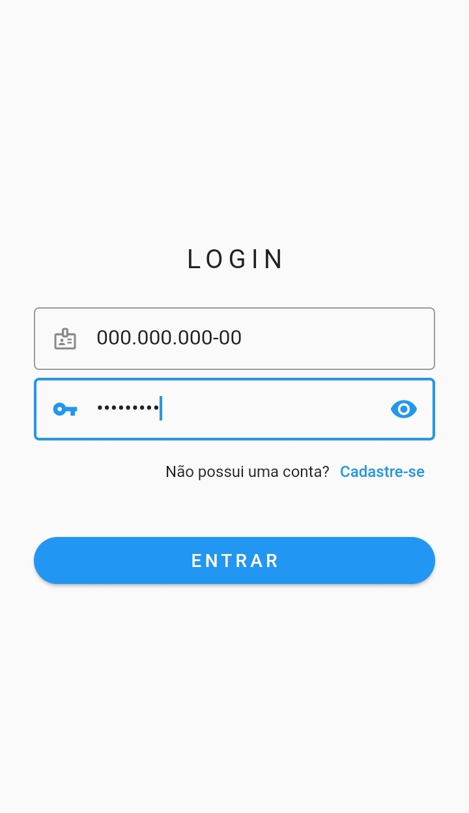
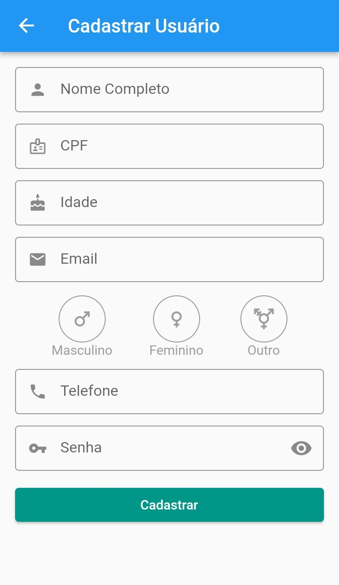
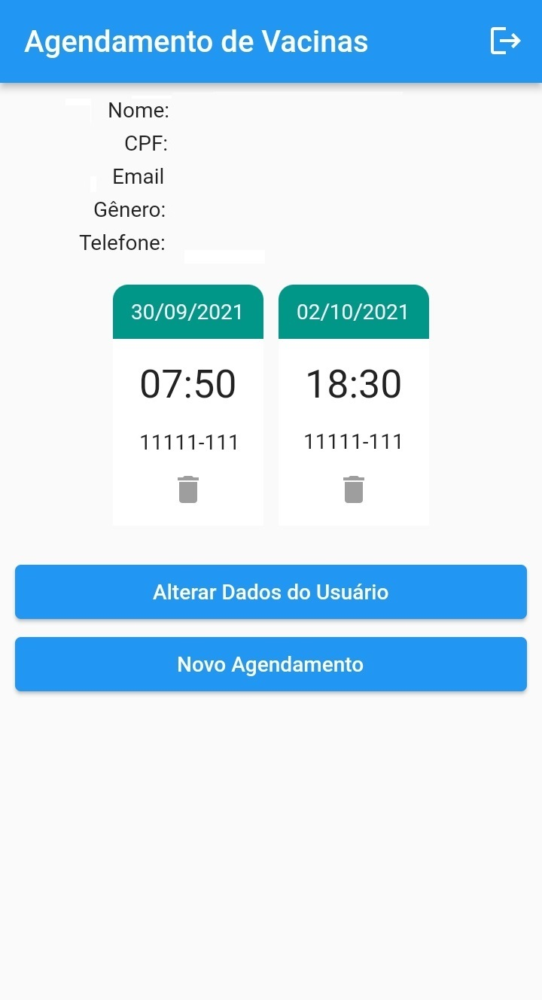
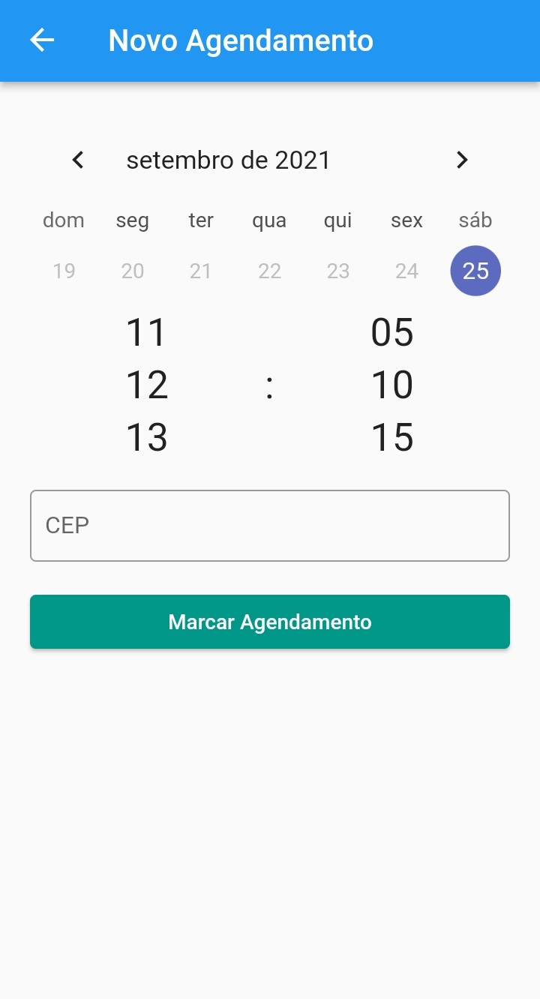

# Agendamento de Vacinação para COVID-19

Protótipo de um programa de Agendamento de Vacinação para COVID-19. A aplicação foi feita utilizando o framework Flutter e possui um sistema de persistência de dados utilizando um banco de dados local simples. Foram incluídos os APK's (que estão dentro da pasta `apks`) para facilitar o teste da aplicação.

**Observação:** A aplicação foi testada somente no sistema Android.

 

